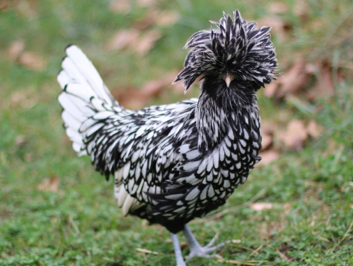

```{r setup, include=FALSE}
knitr::opts_chunk$set(echo = FALSE)
```


## About me
- Name: Drew Hultquist
- Birthday: March 20th
- Grew up around Minden Nebraska
- Birthplace: Hastings Nebraska
- Program: 1st year masters student statistics
- Expected to graduate on May 2023

## Picture of my favorite animal


## Favorite Plot
```{r cars, echo = FALSE, message = FALSE, warning=FALSE}
if (!"palmerpenguins" %in% installed.packages()) {
  remotes::install_github("allisonhorst/palmerpenguins")
}
library(palmerpenguins)
library(ggplot2)


ggplot(penguins, aes(x = body_mass_g, y = bill_length_mm, color = species)) + 
  geom_point(size=.01) + theme(panel.background = element_rect(fill="blue"),  panel.grid.major = element_line(colour = "red", size=5), panel.grid.minor = element_line(colour = "green", size=5))
```

## Link to CV
https://github.com/stat850-unl/11-presentation-ahultquist-1/blob/master/CV.pdf
